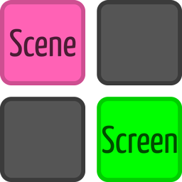
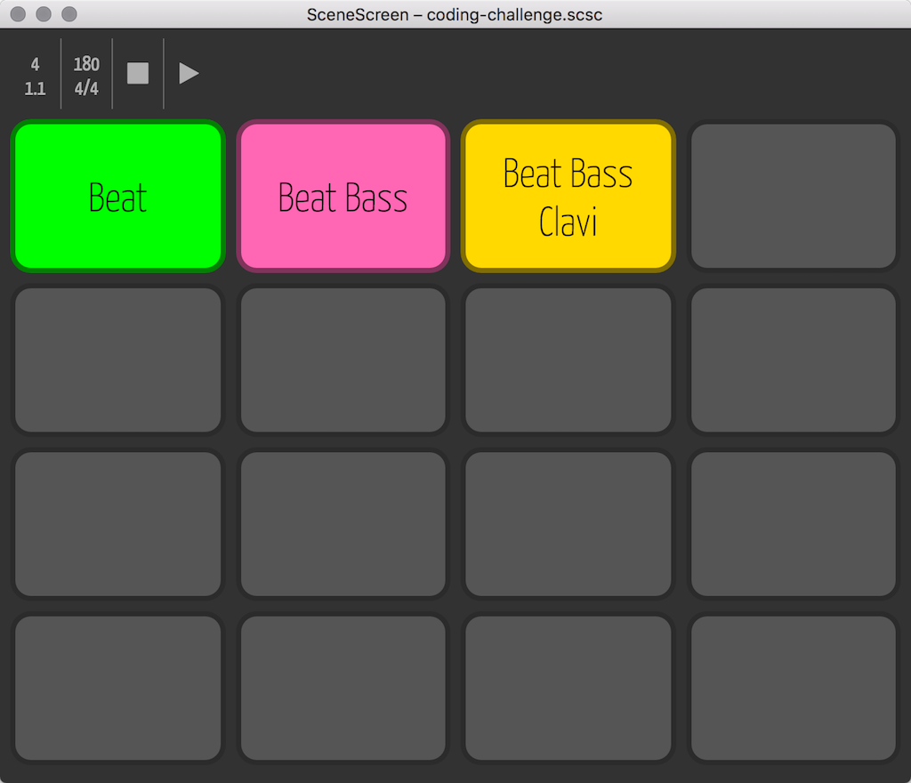
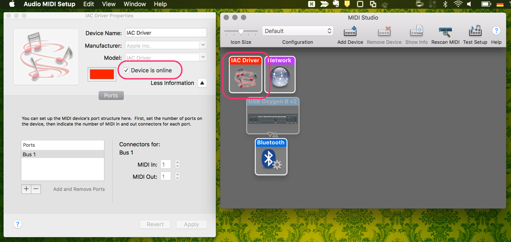

Free music software for Mac OS X. Control your digital audio workstation or sequencer through 
predefined scenes. Works particularly well with [Propellerheads Reason](https://www.propellerheads.se/reason).

* [Download the latest version](https://github.com/pahund/scenescreen/releases/download/v0.2.0/SceneScreen.v0.2.0.Mac.OSX.zip)



## Installation

Prerequisites: [Node.js, at least version 6.2.2](https://nodejs.org/).

```
npm install
```

### MIDI Setup

To use SceneScreen to control a music software such as 
[Propellerheads Reason](https://www.propellerheads.se/reason), you need to set up a MIDI interface
on your machine first.

On a Mac this is done with Audio MIDI Setup:



## Running in Dev Mode

Run these two commands in separate console tabs:

```
npm run hot-server
npm run start-hot
```

## Creating a Build Package

```
npm run package
```

To package apps for all platforms:

```
npm run package-all
```

## License
MIT © [Patrick Hund](https://github.com/pahund)

## Acknowledgements

* Based on [Electron React Boilerplate](https://github.com/chentsulin/electron-react-boilerplate)
  published under the [MIT License](https://github.com/chentsulin/electron-react-boilerplate/blob/master/LICENSE),
  © 2015 [C. T. Lin](https://github.com/chentsulin)
* Uses [Electron](https://github.com/electron/electron),
  published under the [MIT License](https://github.com/electron/electron/blob/master/LICENSE),
  © 2014 [GitHub Inc.](https://github.com/github)
* Uses [React](https://github.com/facebook/react),
  published under the [BSD License](https://github.com/facebook/react/blob/master/LICENSE),
  © 2013–present [Facebook Inc.](https://github.com/facebook),
  all rights reserved
* Uses [Redux](https://github.com/reactjs/redux),
  published under the [MIT License](https://github.com/reactjs/redux/blob/master/LICENSE.md),
  © 2015–present [Dan Abramov](https://github.com/gaearon)
* Uses [redux-saga](https://github.com/yelouafi/redux-saga),
  published under the [MIT License](https://github.com/yelouafi/redux-saga/blob/master/LICENSE),
  © 2015 [Yassine Elouafi](https://github.com/yelouafi)
* Uses [React Router](https://github.com/reactjs/react-router),
  published under the [MIT License](https://github.com/reactjs/react-router/blob/master/LICENSE.md),
  © 2015-present [Ryan Florence](https://github.com/ryanflorence), [Michael Jackson](https://github.com/mjackson)
* Uses [webpack](https://github.com/webpack/webpack),
  published under the [MIT License](https://github.com/webpack/webpack/blob/master/LICENSE),
  © 2012–2016 [Tobias Koppers](https://github.com/sokra)
* Uses [Babel](https://github.com/babel/babel),
  published under the [MIT License](https://github.com/babel/babel/blob/master/LICENSE),
  © 2014–2016 [Sebastian McKenzie](https://github.com/kittens)
* Uses [PouchDB](https://github.com/pouchdb/pouchdb),
  published under the [Apache License 2.0](https://github.com/pouchdb/pouchdb/blob/master/LICENSE)
* Uses [Node.js](https://github.com/nodejs/node),
  published under [this license](https://github.com/nodejs/node/blob/master/LICENSE),
  © Node.js contributors, all rights reserved
* Uses [Font Awesome](https://github.com/FortAwesome/Font-Awesome)
  by [Dave Gandy](https://github.com/davegandy),
  [license note](https://github.com/FortAwesome/Font-Awesome#license)
* Uses [React Inline Edit Kit](https://github.com/kaivi/riek),
  published under the [MIT License](https://github.com/kaivi/riek/blob/master/LICENSE),
  © 2016 [Kai Vik](https://github.com/kaivi)
* Uses [Yanone Kaffeesatz](https://www.yanone.de/fonts/kaffeesatz/) font face,
  © 2004 Jan Gerner
* Portons of the code is based on [Metronome.js](https://gist.github.com/nick-thompson/4551106),
  published under the MIT License,
  © 2012 [Nick Thompson](https://gist.github.com/nick-thompson)
